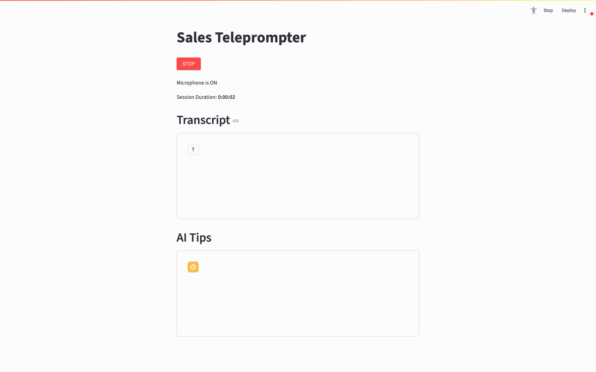

# sales-teleprompter

sales-teleprompter is an AI-powered application that transcribes conversations in real time and generates helpful tips from them to help you close that deal.

It's built with Python using [Streamlit](https://streamlit.io/) and [streamlit-webrtc](https://github.com/whitphx/streamlit-webrtc).

It uses [Deepgram](https://deepgram.com/) for Speech-to-Text and [GPT-4o](https://platform.openai.com/docs/models/gpt-4o) for generating tips. API keys for both are required and can be set in `config.py`.

[ffmpeg](http://www.ffmpeg.org/) available on the system path is required. Alternatively, you can change `format` in utils.transcribe to "wav" and skip this dependency, but will experience slower transcriptions.

It can be run with `streamlit run teleprompter.py`

Usage Demo: 